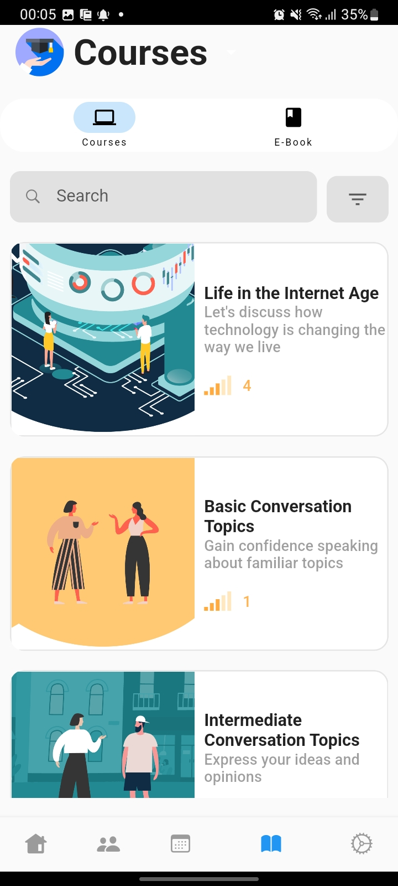
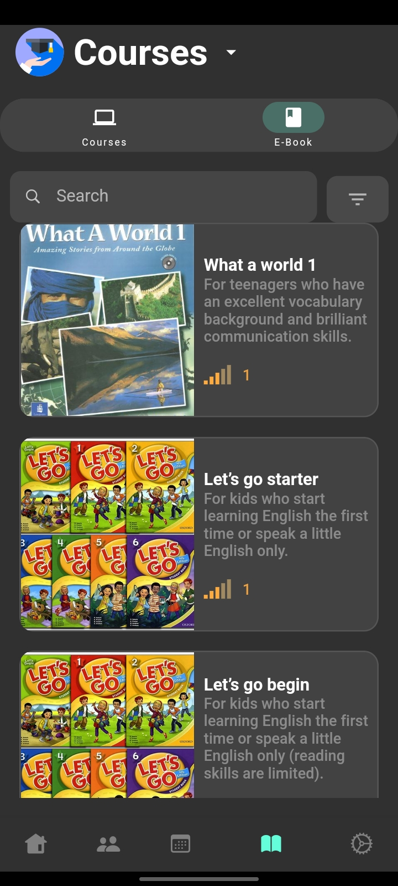

### LetTutor

### Advanced Mobile Final Project 

## Introduction

This is an mobile Flutter Application that develop base on [LetTutor web app](https://sandbox.app.lettutor.com/)

This app have some main functional:
- **Offering English courses**: Offers various courses in English for different levels and purposes, such as conversation, business, academic, IELTS, TOEFL, etc.
- **Connecting learners and tutors**: Connects learners with tutors who can help them improve their English skills through live lessons and interactive e-books.
- **Providing course details**: Provides information about the course categories, subcategories, levels, lessons, objectives, videos, transcripts, etc.
- **Multiple language, theme**

## Some Screenshots

 

<!-- For help getting started with Flutter development, view the
[online documentation](https://docs.flutter.dev/), which offers tutorials,
samples, guidance on mobile development, and a full API reference. -->

